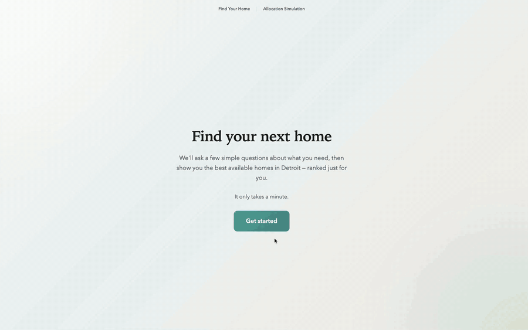
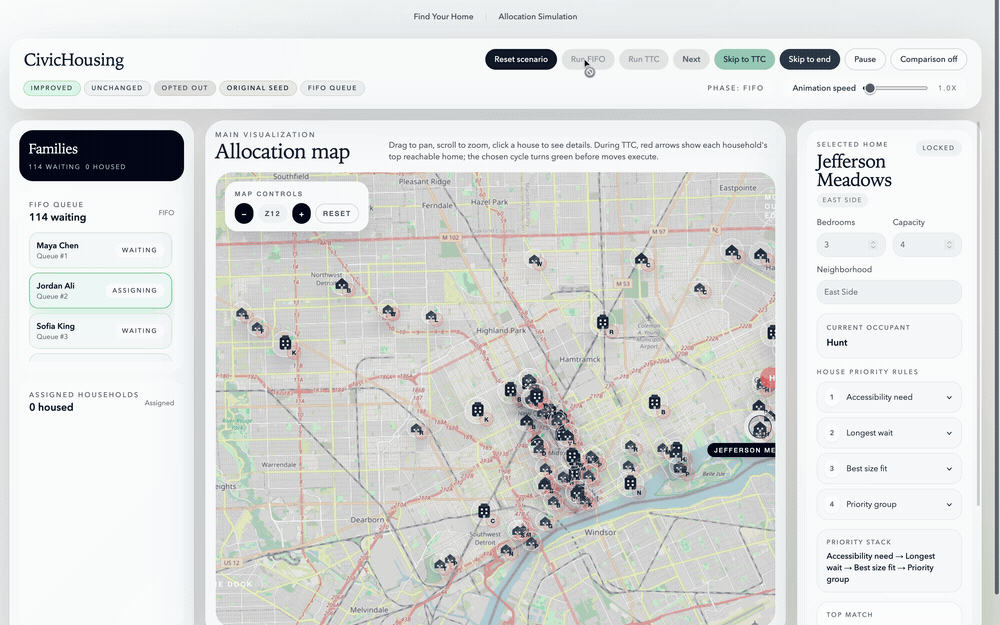

# CivicHousing

A civic technology platform that makes public housing allocation accessible and transparent. Built for the **Google x CSG x T4SG 2026 Hackathon** (Track 5: Housing & Urban Development), CivicHousing pairs an accessibility-first intake wizard with an interactive allocation simulation that demonstrates how coordinated exchange algorithms can improve outcomes over simple queue-based systems.

### Tenant Experience

The wizard collects household needs, scores 76 Detroit listings, and lets applicants drag-rank their preferences.



### Allocation Engine

Starting from FIFO assignments, TTC finds exchange cycles where every participant moves to a more-preferred unit. No one is worse off, and honest preferences are always optimal (no gamification). The demo ends by zooming in on a household whose rank improved from 34 to 10.



## The Problem

Public housing allocation is opaque and inaccessible. Applicants face confusing processes, limited visibility into available units, and no way to express preferences about where they live. Meanwhile, first-come-first-served (FIFO) allocation often produces suboptimal matches that could be improved through coordinated exchange.

CivicHousing addresses this by giving applicants a guided, accessible intake process and showing how Top Trading Cycles (TTC) can improve housing outcomes without making anyone worse off.

## What We Built

### Personalized Housing Wizard (`/realtor`)

An accessibility-first wizard designed for seniors and disabled users. Large touch targets, plain language, and a step-by-step flow collect household size, accessibility needs, and location preferences. The system then scores all 76 Detroit housing listings against the applicant's profile and presents ranked results on an interactive Leaflet map with hospitals, transit hubs, schools, and government services. Applicants can drag to reorder their rankings, which feed directly into the allocation simulation.

### Allocation Simulation (`/`)

An animated visualization comparing two allocation algorithms side by side:

- **FIFO**: Sequential vacancy filling. Each unit goes to the next eligible household in queue order.
- **TTC (Top Trading Cycles)**: Starting from the FIFO baseline, households participate in coordinated exchange cycles where everyone moves to a higher-preference unit simultaneously. No one is made worse off.

The simulation runs on real Detroit housing data (76 units from the One Billion Dollar Affordable Multifamily Housing Construction Sites dataset) with animated step-by-step execution, speed control up to 20x, skip buttons, and a metrics dashboard showing improved/unchanged/opted-out counts.

### The Pipeline

The wizard's output (ranked preferences + household profile) feeds directly into the first queue entry in the allocation simulation, demonstrating the full flow: **accessible intake, personalized ranking, fair allocation**.

## Tech Stack

Next.js 15 · React 19 · TypeScript · Tailwind CSS · Framer Motion · Leaflet · OpenStreetMap

## Run Locally

```bash
npm install
npm run dev
```

Open [localhost:3000/realtor](http://localhost:3000/realtor) for the housing wizard, or [localhost:3000](http://localhost:3000) for the allocation simulation.

## Context

Built in one day for the Google x CSG x T4SG 2026 Hackathon. Track prompt: *"How might we support tenants in navigating housing systems?"*

Housing data sourced from Detroit's One Billion Dollar Affordable Multifamily Housing Construction Sites, augmented with simulated attributes for demonstration purposes.
